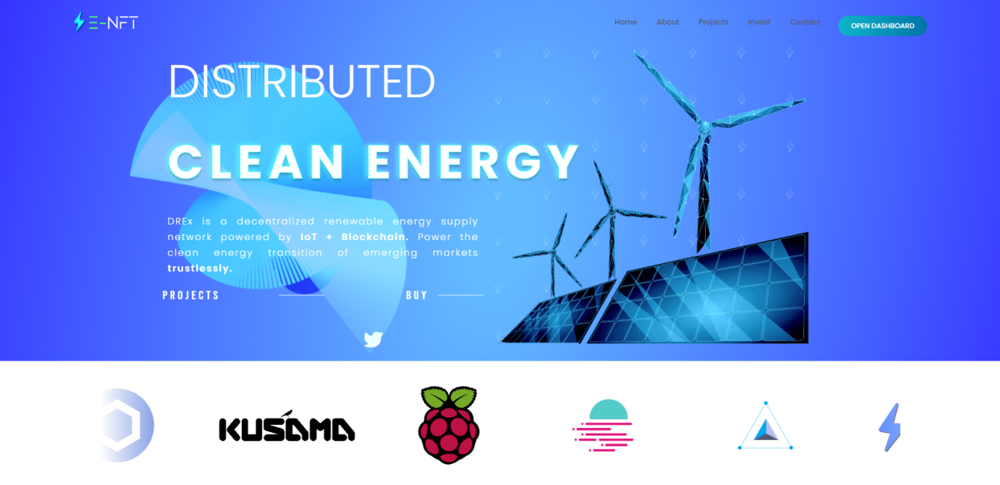
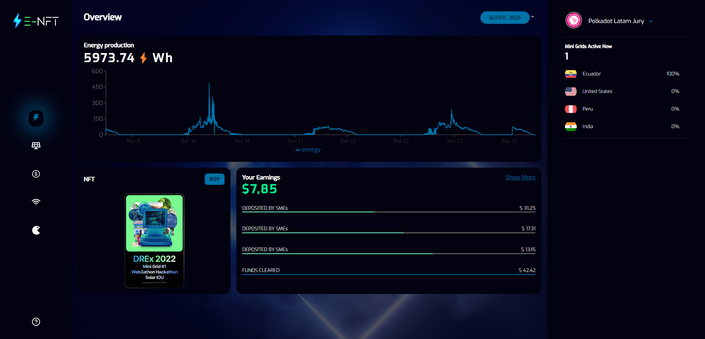

# Front-end UI/UX

We developed both a landing page



and a user interface for our dApp




### Installation

Install dependencies
```bash
npm install
```
Then start the server
```bash
npm run start
```

IMPORTANT! Given that this POC is using an open API, it requires bypassing CORS certificates. For this, you can install a [CORS certificate browser extension](https://chrome.google.com/webstore/detail/cors-unblock/lfhmikememgdcahcdlaciloancbhjino/related) or visit cors-anywhere.herokuapp.com and click 'Demo". This will enable your browser to render the data graphically.