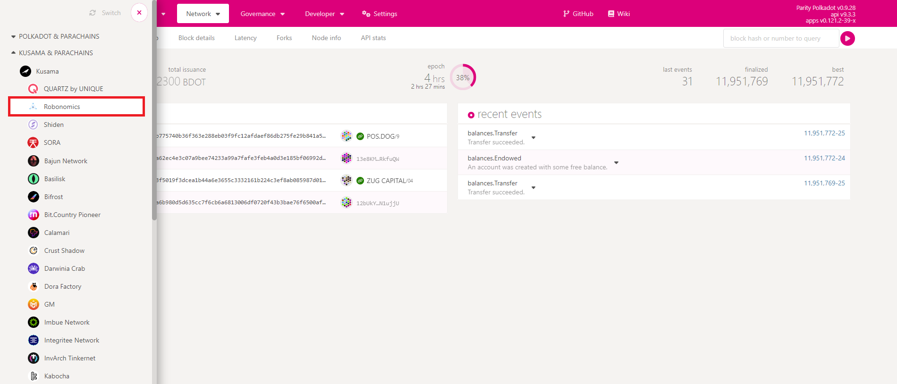
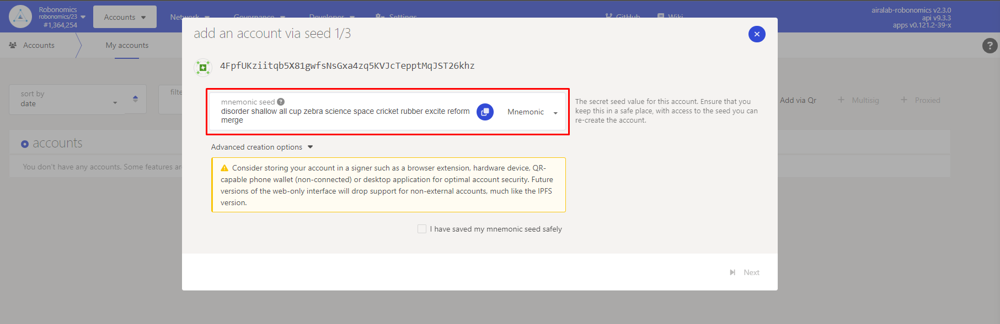
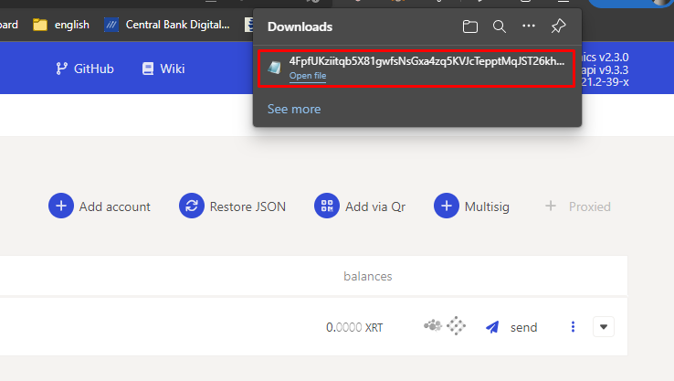

## Installation
- Prepare the RPI for Substrate libs ([source](https://www.rust-lang.org/tools/install)):
```bash
curl --proto '=https' --tlsv1.2 -sSf https://sh.rustup.rs | sh
rustup default nightly
```
- Install gpiozero library ([source](https://gpiozero.readthedocs.io/en/stable/installing.html)) and reboot:
```bash
sudo apt update
sudo apt install python3-gpiozero
sudo reboot
```
- Clone the repository
```bash
git clone https://github.com/ahronsz/robonomics-drex-demo.git
```
- Install project requirements
```bash
pip3 install -r requirements.txt
```

## Account management
To create a Robonomics account on the Kusama network:
(https://polkadot.js.org/apps/)

1. First, navigate to the Robonomics parachain in Polkadot-js:



2. Go to the "Accounts" tab and create an account. **Save the mnemonic seed key for future operations.**



3. Once finished, we must save the following generated file. **This account can be used in the various parachains found in Polkadot.js, select the 'Restore Json' option and then import the generated file.**




## Run Robonomics sensor retrieval
Run this in repo folder:
```bash
python3 main.py <previously saved seed>
```
You can send tokens from another account created the same way via `assets:transfer` *extrinsic* on 
[Statemine](https://polkadot.js.org/apps/?rpc=wss%3A%2F%2Fkusama-statemine-rpc.paritytech.net#/explorer).

As soon as there is an income (positive change in `assets:account` *storage function* for address derived from seed and for token id `102`)

## Things to note
- This is a POC of a blockchain-driven IoT device, it has things to improve, wires to hide and functionality to implement
- Right now the only thing that matters for income tracker is the positive difference between current and previous
asset balance. This may be filtered [code](https://github.com/ahronsz/robonomics-drex-demo/blob/main/services/statemine_monitor.py).
- Powered by [Robonomics](https://robonomics.network/).
