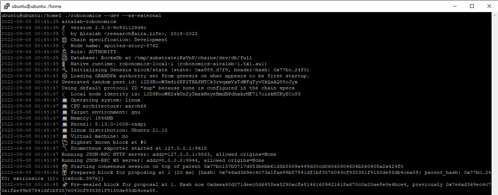
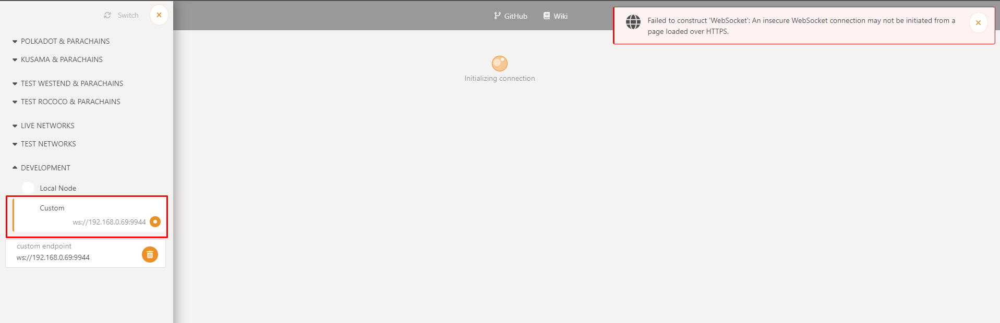
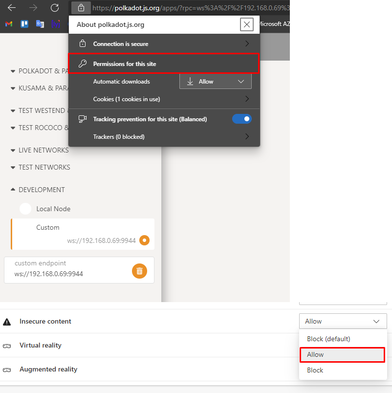
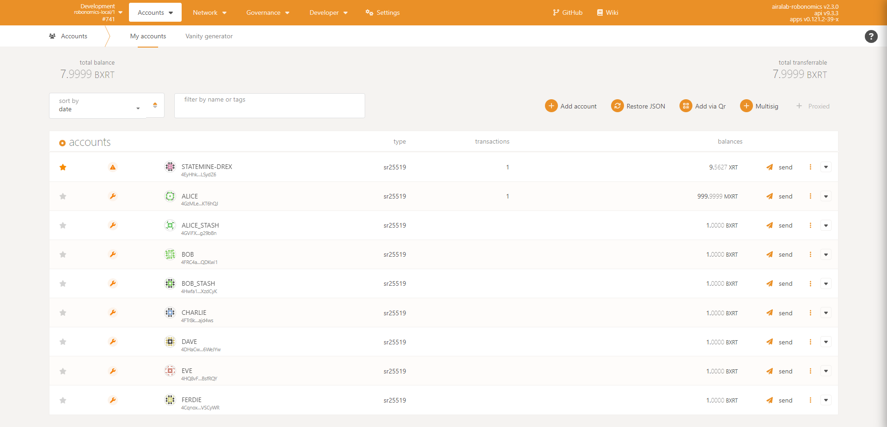
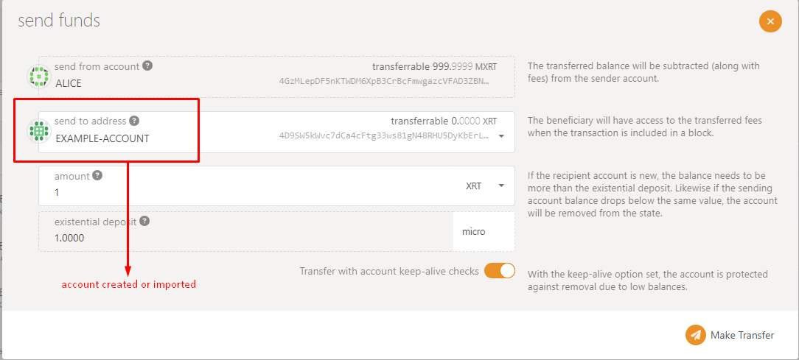

# How to run robonomics dev node
1. First, you need a binary file, download the archive with it from the [latest release](https://github.com/airalab/robonomics/releases).

2. Unpack it and change permissions:
```
tar xf robonomics-x.x.x-{x86_64|aarch64}-unknown-linux-gnu.tar.gz
chmod +x robonomics
```

3. And run in --dev mode with open WebSocket ports:
```
./robonomics --dev --ws-external
```
You will see the following output:



## Account management
For local development, navigate to the Development tab type in a selected port (whichever you have started your development node on)



Enable insecure content:



We have successfully connected to our local node:



# Get tokens
We can use the same account that we created in setting up our account, simply transfer test tokens from the sudo authority on your development node (in this case Alice) to your account:


